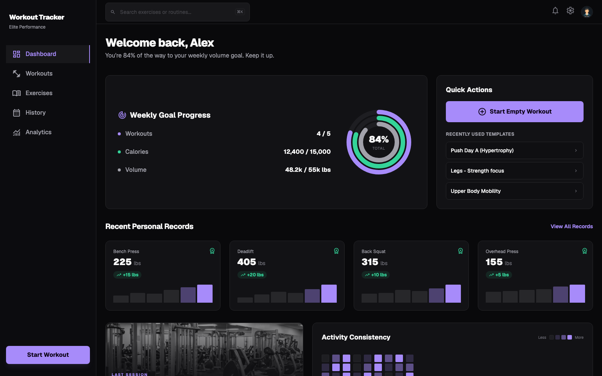
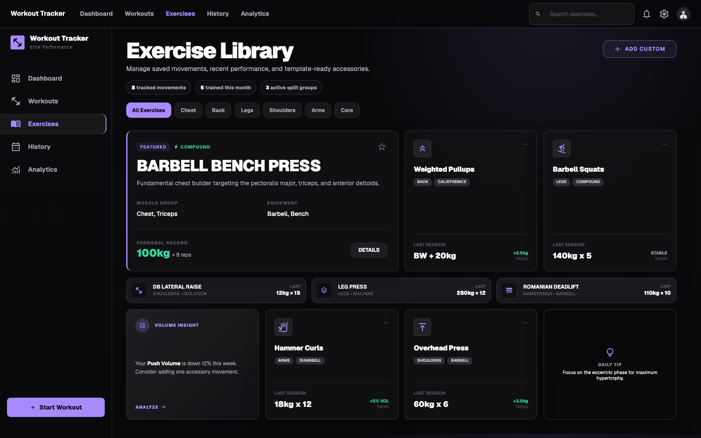
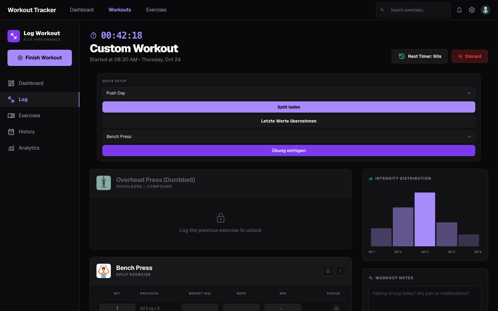
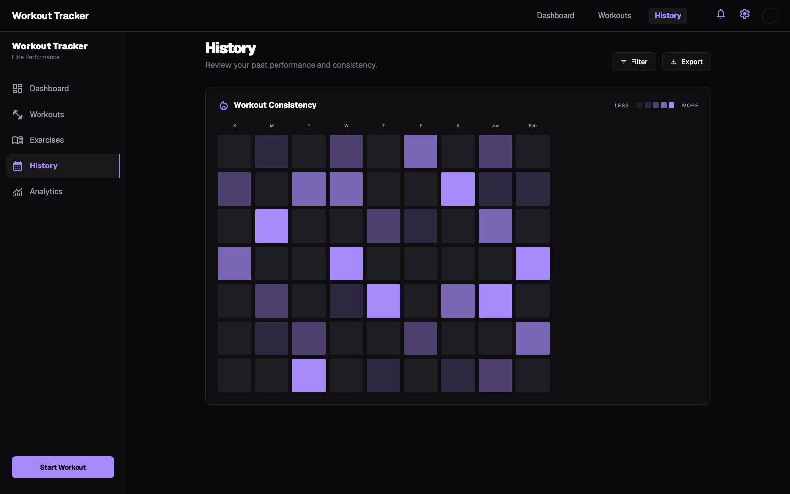
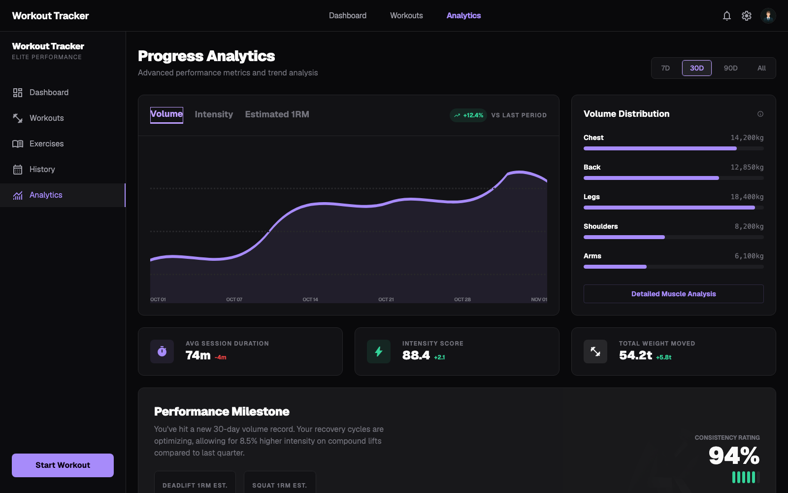
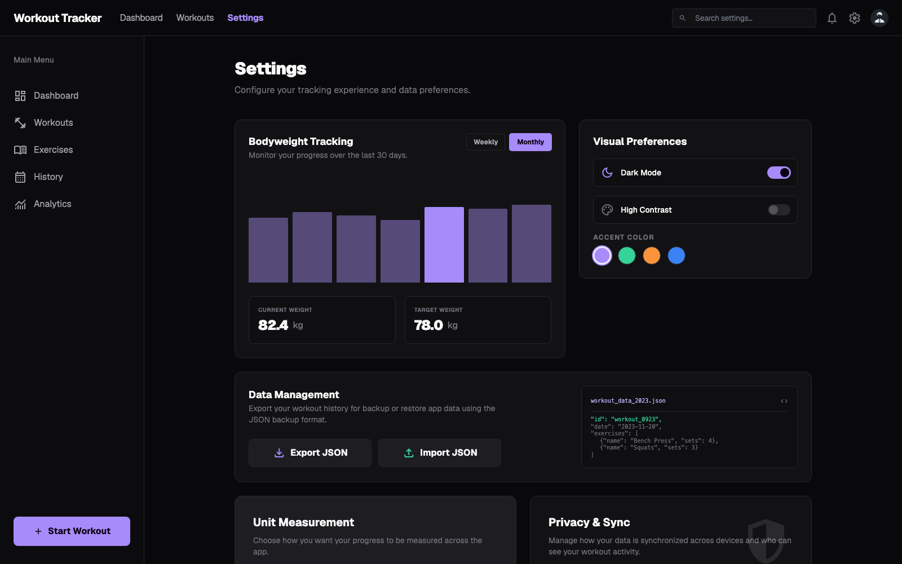
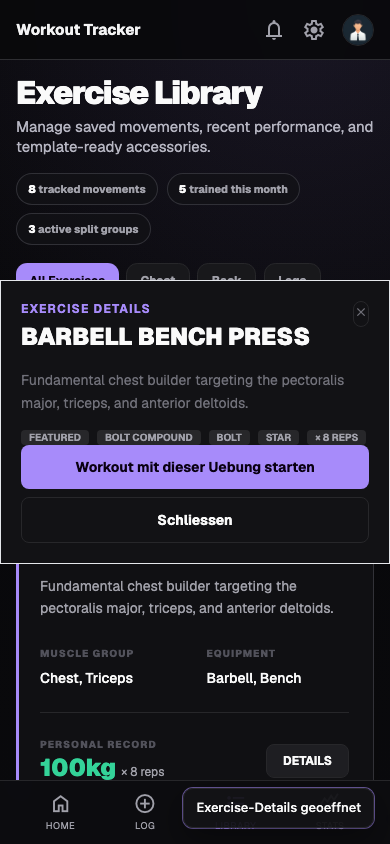

# Workout Tracker

Local-first workout tracking app built with React + Vite and deployed on GitHub Pages.
The project is designed to demonstrate product thinking, mobile-friendly UX, data modeling, testing discipline, and practical frontend engineering in a portfolio context.

## Demo

- Live app: https://sefa123451.github.io/Workout-Tracker/
- Quick walkthrough: [`docs/media/workout-flow.gif`](docs/media/workout-flow.gif)
- Run locally:
  - `npm install`
  - `npm run dev`

## What To Evaluate In 2 Minutes

1. Open `Dashboard` for training summary, heatmap, and recommendations.
2. Open `Exercises` and click an exercise card to inspect details or start a workout from it.
3. Open `Log workout` to use the mobile-first workout logging controls.
4. Open `History` and `Analytics` for review, trends, and progress context.
5. Open `Settings` for bodyweight logging and import/export flow.

## Product Screens

## Feature Highlights

- Exercise library with filters, detail modal, recent performance context, and direct workout starts
- Split planner with weekly targets and default sets per exercise
- Workout templates (create, load, duplicate, edit, rename, delete)
- Workout logging with notes, mood, effort, per-set tracking, mobile dock controls, and rest timer access
- History with calendar heatmap, day review, and PR timeline
- Progress analytics for exercise and split modes across 7/30/90-day windows
- Bodyweight check-ins with trend context
- Data portability:
  - JSON export/import
  - import preview with replace/merge choices
  - CSV export for workout history
- Undo support for destructive delete actions

## Architecture Overview

### Frontend

- `src/App.jsx`: app shell, Stitch iframe integration, and cross-screen actions
- `public/stitch/*`: generated desktop/mobile screen markup used by the deployed UI
- `src/hooks/useAppController.jsx`: centralized state/actions orchestration
- `src/components/*`: screen and section components
- `src/styles.css`: design tokens, layout, and responsive styles

### Domain and Storage

- `src/lib/workoutShared.js`: core helpers, validation, date/format utilities
- `src/lib/workoutStorage.js`: persistence, import/export normalization
- `src/lib/workoutAnalytics.js`: dashboard/history/progress aggregations
- `src/lib/progressAnalytics.js`: signal copy and decision guidance helpers

### Design Decisions

- Local-first by default: no account required, instant startup, full data ownership.
- GitHub Pages deployment keeps the gym/mobile flow reachable without a backend.
- Backward compatibility: existing `localStorage` shape and import/export compatibility are preserved.
- Defensive input handling: invalid dates/entries are sanitized or rejected early to prevent runtime crashes.

## Testing And Quality

### Commands

- `npm run lint`
- `npm run format:check`
- `npm test`
- `npm run test:e2e`
- `npm run build`

### Scope

- Integration coverage for key user flows in `src/App.test.jsx`
- Utility/data model coverage in `src/lib/workoutData.test.js`
- Component-focused tests for major UI surfaces
- Lightweight browser smoke checks via `scripts/e2e-smoke.mjs`
- CI (`.github/workflows/ci.yml`) runs lint + format check + unit/integration tests + build + e2e smoke checks on push/PR
- GitHub Pages deploy (`.github/workflows/pages.yml`) publishes the latest `main` build

## Scripts

- `npm run dev` - start Vite dev server
- `npm run build` - production build
- `npm run preview` - preview production build
- `npm test` - run tests once
- `npm run test:e2e` - run lightweight browser smoke checks
- `npm run lint` - run ESLint
- `npm run lint:fix` - run ESLint with autofix
- `npm run format` - format code with Prettier
- `npm run format:check` - verify Prettier formatting
- `npm run capture:media` - regenerate portfolio screenshots and walkthrough GIF

## Limitations

- No backend/auth/cloud sync (intentional for local-first scope)
- No multi-device conflict resolution
- No server-side data sharing

## Roadmap

- Optional cloud sync mode while preserving local-first defaults
- Additional history/progress filtering controls
- Further modularization of controller-level state logic

## License

MIT - see [`LICENSE`](LICENSE)
